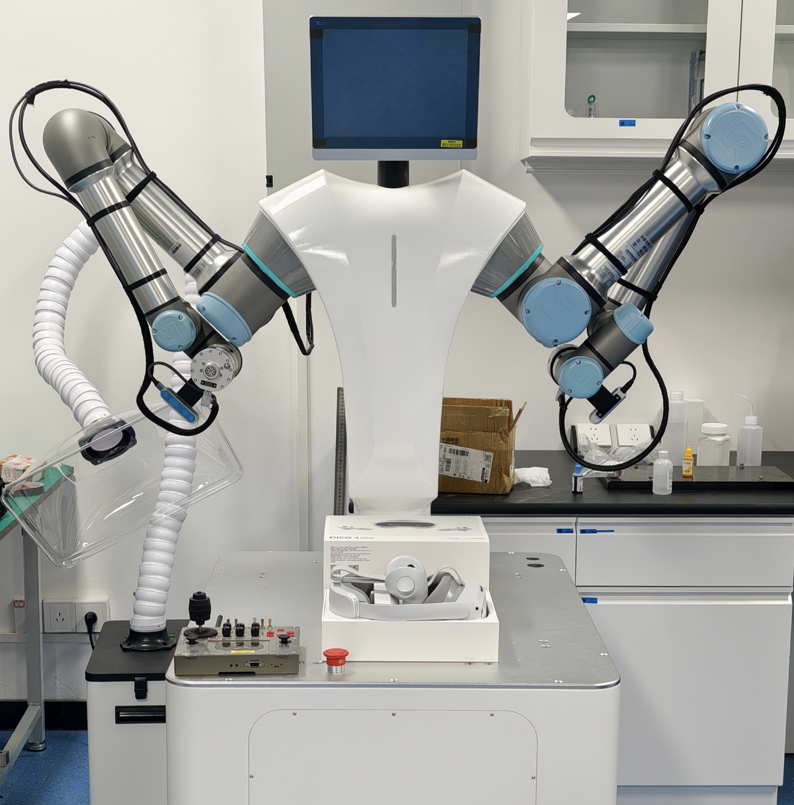

# UR双臂VR遥操作数据采集与回放指南
<p align="center">
  
  <br>
</p>

## 1. 环境配置

### 1.1 创建并激活 conda 环境
```bash
conda create -n ur_data python=3.10
conda activate ur_data
```

### 1.2 安装 lerobot
```bash
# 安装指定版本 0.3.4 下的固定commit
git clone https://github.com/huggingface/lerobot.git
cd lerobot
git checkout da5d2f3e9187fa4690e6667fe8b294cae49016d6
pip install -e .
```

### 1.3 安装 [XRoboToolkit](https://github.com/XR-Robotics)
- 请先完成[XRoboToolkit](https://github.com/XR-Robotics)中`Get Started`的第一步和第三步。
- 随后完成以下安装：
```bash
git clone https://github.com/XR-Robotics/XRoboToolkit-Teleop-Sample-Python.git
cd XRoboToolkit-Teleop-Sample-Python
bash setup_conda.sh --install
```
- 最后，请完成`Get Started`第四步的前三步，以确保VR设备可以正常的与电脑进行通信。

### 1.4 克隆并安装 VR 遥操作控制源码
```bash
mkdir ur_data_collection && cd ur_data_collection
git clone https://github.com/scy-v/lerobot_ur_dual_vrteleop.git
cd lerobot_ur_dual_vrteleop
pip install -r requirements.txt # 以可编辑形式安装所有包
```

### 1.5 查看可运行的命令
运行以下命令以查看所有可用的脚本：
```bash
vr-help
# ==================================================
#  VR Teleoperation Utilities - Command Reference
# ==================================================

# Core Commands:
#   vr-record           Record teleoperation dataset
#   vr-replay           Replay a recorded dataset
#   vr-visualize        Visualize recorded dataset

# Tool Commands:
#   tools-check-dataset   Check local dataset information
#   tools-check-rs        Retrieve connected RealSense camera serial numbers

# Shell Tools:
#   map_gripper.sh        Map Gripper Serial Port

# Test Commands:
#   test-gripper-ctrl     Run gripper control command (operate the gripper)

# --------------------------------------------------
#  Tip: Use 'vr-help' anytime to see this summary.
# ==================================================
```
## 2. 获取和配置必要参数

### 2.1 获取 RealSense 相机序列号
请确保每次仅连接一个相机:
```bash
tools-check-rs
```

### 2.2 固定夹爪串口映射
例如，将夹爪映射到 `/dev/ur_left_gripper`, 执行此操作前，请确保仅连接一个夹爪的usb设备。
```bash
map_gripper.sh ur_left_gripper
```
随后，将设定的映射值填入`cfg.yaml`中的`left/right_gripper_port`字段

## 3. 数据集记录

### 3.1 上传数据到 Hugging Face（可选）
1. 在 `cfg.yaml` 中设置：
```yaml
push_to_hub: True
```
2. 获取 Hugging Face 账号的 token 并登录：
```bash
huggingface-cli login --token ${HUGGINGFACE_TOKEN} 
huggingface-cli whoami  # 检查是否登录成功
```

### 3.2 开始记录
1. 打开 UR5e 示教器上的 **Remote Control**。
2. 确认 `cfg.yaml` 中参数配置正确。
3. 为了确保数据收集过程规范，请先阅读 `9. 数据集命名与记录详解` 以了解数据记录细节.
4. 确保VR设备与电脑正常连接,然后再运行以下命令:
```bash
vr-record
```
<!-- <p align="center">
  
  <br>
  <b>Figure 1: Record</b>
</p> -->

## 4. 数据集回放
```bash
vr-replay #注意cfg配置
```

## 5. 数据集可视化
```bash
vr-visualize #注意cfg配置
```
<!-- <p align="center">
  
  <br>
  <b>Figure 2: Visualization</b>
</p> -->

## 6. 数据集追加与恢复
如果你已经在指定的 `repo_id` 下录制过数据集，可以在 `cfg.yaml` 中将 `resume` 设置为 `True`，并在 `resume_dataset` 中填写要追加的数据集名称，以便在现有数据集的基础上继续录制。然后运行以下命令：
```bash
vr-record
```

## 7. 数据集合并
如果你在不同阶段分别录制了数据集，请确保各阶段的数据集具有不同的 `repo_id`, 完成录制后，可通过以下命令将它们合并为一个数据集: 
```bash
lerobot-edit-dataset 
    --repo_id <merged_repo_id> 
    --operation.type merge 
    --operation.repo_ids "['<repo_id_1>', '<repo_id2>']"
```
- 更多数据集处理命令，请参考 [LeRobot](https://huggingface.co/docs/lerobot/using_dataset_tools)

## 8. VR控制器按键说明

1. **右手柄**
   1. **A按钮**: 按下表示当前episode的录制结束
   2. **B按钮**： 按下表示重置环境
   3. **扳机键**：按下即可控制机器人，释放则无法控制
   4. **握持键**：按下即可闭合夹爪，释放则打开
2. **左手柄**
   1. **X按钮**：按下表示重新开始当前episode的录制
   2. **Y按钮**：按下表示录制结束，保存并退出录制
   3. **菜单按钮**：抛出异常，直接结束，并删除当前已录制数据(Y/N)。 
   4. **扳机键**：按下即可控制机器人，释放则无法控制
   5. **握持键**：按下即可闭合夹爪，释放则打开
3. **录制步骤**：
   1. `开始录制 (可自由按下扳机和握持键)` -> `按下A按钮，当前episode的录制结束` -> `按下B按钮，开始重置机器人(可自由按下扳机和握持键)` -> `按下A按钮，重置结束` -> `按下B按钮，开启下一个episode的录制` -> `依次循环，直到按下Y按钮正常退出`
   2. `开始录制 (可自由按下扳机和握持键)` -> `按下菜单按钮(抛出异常，选择是否清除录制数据,程序结束)`
   3. `开始录制 (可自由按下扳机和握持键)` -> `按下Y按钮，录制结束，正常保存数据`
   
## 9. 数据集命名与记录详解
### 1. 数据集命名
<p align="center">
  
  <br>
  <b>Figure 3: Dataset</b>
</p>

<p align="center">
  
  <br>
  <b>Figure 4: Dataset Info</b>
</p>

1. 数据集默认保存在 `~/.cache/huggingface/lerobot` 目录下，包含三类内容：

   - `dataset_info.txt`：自动记录本地数据集信息，包括以下字段：`record_id`、`name`、`task`、`date`、`version`、`user_info` 和 `type`。其中，`user_info` 可以通过 `cfg.yaml` 中的 `user_notes` 进行注解。

   - `dataset_info_backup`：当通过 `tools-check-dataset` 手动更新 `dataset_info.txt` 时，保存旧的记录备份。

   - 数据集文件夹：存放实际的数据集内容。

2. 数据集命名格式为 `[description]_[date]_[version]`。其中：
   - `description` 来源于 `cfg.yaml` 中的 `repo_id=<user_name>/<description>`；
   - `date` 会自动生成；
   - `version` 会根据是否存在同名数据集( `repo_id` 相同)自动生成新版本号。
3. description 命名规则：`task.description -> Verb_SourceObject_prep_TargetObject`。  
   即将 `cfg.yaml` 中的 `task.description` 按照上述格式映射生成。例如：  
   `Pick up the green cube and put it into the trash bin -> pick_greencube_into_trashbin`。

### 2. 数据记录说明
1. 完成步骤 `2. 获取和配置必要参数`。
2. 根据任务内容，在 `cfg.yaml` 的 `task.description` 中填写指令，并根据数据集命名规则设置 `repo_id`。
3. 检查并调整 `cfg.yaml` 中的其他参数，确保配置正确。
4. 运行命令 `vr-record`，然后按照 `8. VR控制器按键说明` 完成录制操作。
5. 数据记录结束后，数据集同级目录会生成 `dataset_info.txt` 文件，用于保存本地数据集信息。如果手动删除过数据集，可通过以下命令更新记录信息：
```bash
tools-check-dataset
```